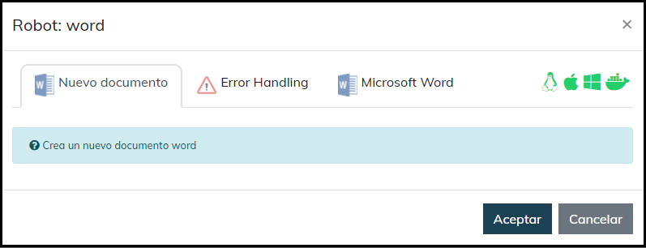
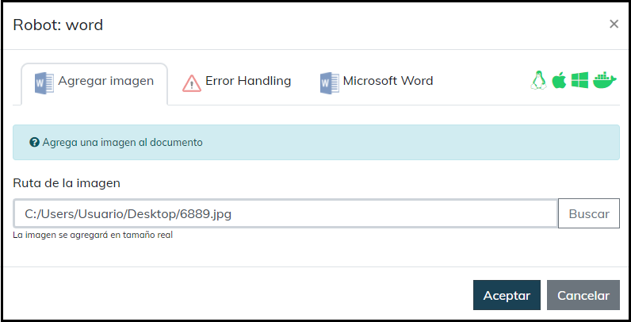
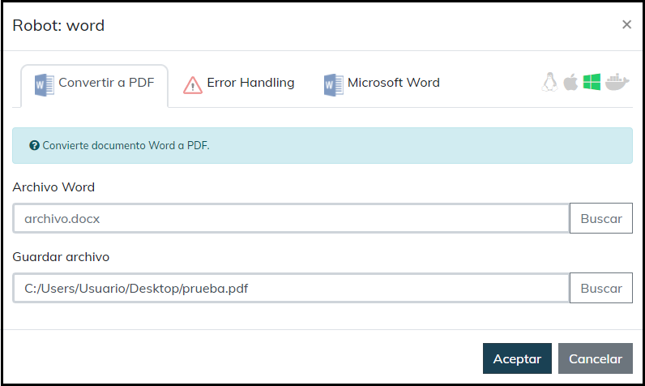
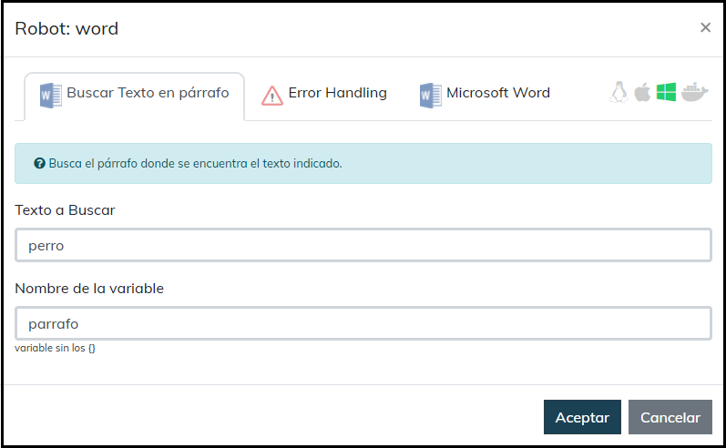
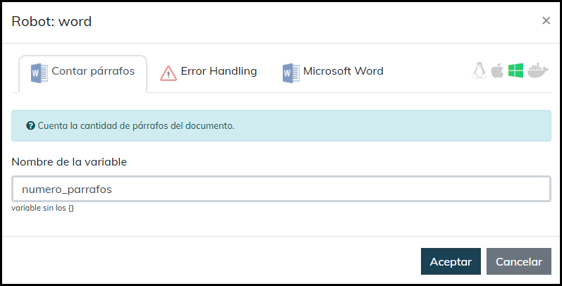

# Microsoft Word
  
Modulo para trabajar con Microsoft Word  
  

## Como usar este módulo:

Con este módulo tu puedes hacer lo siguiente:

1) Nuevo Documento
2) Abrir Documento
3) Leer Documento
4) Leer Tabla
5) Guardar Documento
6) Escribir en Documento
7) Cerrar Documento
8) Insertar página
9) Agregar imagen
10) Convertir a PDF
11) Buscar texto en párrafo
12) Contar párrafos
13) Reemplazar texto en párrafos
14) Agregar texto  a un marcador
15) Copiar de Excel a Word

## 1- Nuevo documento
Con este comando puedes crear un nuevo documento de word. Este comando no necesita parámetros

## 2- Abrir documento
Con este comando puedes abrir un documento word. Debes indicar la ruta del documento que quieres abrir, incluida la extensión .docx

## 3- Leer documento
Este comando extrae texto del documento word. Debes escribir el nombre de la variable donde se guardará el texto y si quieres obtener más información como estilo, detalles del párrafo, etc. Debes marcar la casilla “Agregar detalles”.

### Resultado
En la variable guardará el texto como una lista, donde cada párrafo es un
elemento de la lista.

## 4- Leer tabla
Este comando extrae los datos de una tabla. Debes escribir el nombre de la variable donde se guardaran los datos de la tabla.

### Resultado
Guarda en una variable una lista donde cada fila es otra lista.

## 5- Guardar documento
Este comando guarda el documento Word abierto. Debes indicar la ruta donde quieres que se guarde, incluida la extensión .docx

## 6- Escribir en documento
Este comando permite escribir texto en el documento. 
● Escriba texto: Ingrese el texto que quiere escribir en el documento.  
● Tipo de texto: Seleccione el tipo de texto que quiere escribir, por
ejemplo un párrafo, título, viñeta, etc. 
● Nivel: Completar para los tipos de texto que tengan niveles. Por
ejemplo títulos (título 1, título 2, etc), viñetas, etc. 
● Tamaño de fuente: Seleccione el tamaño del texto. 
● Alineación: Seleccione el tipo de alineación del texto, por ejemplo,
derecha, central, etc. 
● Marque las casillas de negrita, cursiva y subrayar, según lo que
necesite.

## 7- . Cerrar documento
Este comando cierra el documento que se está ejecutando. Es importante que antes de utilizar este comando, utilices el comando de guardar documento.

## 8- Insertar página
Este comando inserta una nueva página al documento que se está ejecutando.

## 9-  Agregar imagen
Este comando agrega una imagen al documento. Debes indicar la ruta de la imagen que quieres agregar, incluida la extensión .jpg

## 10-  Convertir a PDF
Este comando convierte un documento Word en PDF. Si es el documento que ya está abierto dejar el campo “Archivo Word” dejar el campo vacío. En el camp “Guardar Archivo” debes seleccionar el lugar donde quieras guardar el PDF con su nombre y la extensión .pdf

## 11- Buscar texto en párrafo
Este comando busca el párrafo donde se encuentra el texto indicado a buscar, Debes escribir el nombre de la variable donde se guardaran los datos.

### Resultado
Guardará en la variable la línea en donde se encuentre la palabra a buscar.

## 12- Contar párrafos
Este comando cuenta la cantidad de párrafos del documento, debes escribir el nombre de la variable donde se guardaran los datos

## 13- Reemplazar texto en párrafo
Reemplaza un texto en el documento en el párrafo indicado.  
● En Texto a buscar debes colocar la palabra que quieres reemplazar. 
● En Texto a reemplazar ira la palabra que reemplaza el texto a buscar. 
● En Lista de párrafo es la posición del párrafo donde se encuentra el texto que quieres reemplazar

## 14- Agregar texto a un marcador
Este comando agrega texto a un marcador de Microsoft Word. Debes escribir el nombre del marcador en
el comando exactamente igual a como está guardado en Microsoft Word.

## 15- Copiar de Excel a Word
Con este comando puedes copiar contenido de un archivo Excel y pegarlo en un documento Word, especificando el rango donde se encuentra el contenido que se quiere copiar del archivo Excel y el parrafo donde se va a pegar en el archivo Word, si no se especifica el parrafo por defecto el contenido copiado sera pegado al final del documento

 
## Como instalar este módulo
  
__Descarga__ e __instala__ el contenido en la carpeta 'modules' en la ruta de rocketbot.  

## Descripción de los comandos

### Nuevo documento
  
Crea un nuevo documento word
|Parámetros|Descripción|ejemplo|
| --- | --- | --- |

### Abrir Documento
  
Abre un documento de Word.
|Parámetros|Descripción|ejemplo|
| --- | --- | --- |
|Archivo|Abre el documento especificado|archivo.docx|

### Leer documento
  
Extrae texto de documento Word.
|Parámetros|Descripción|ejemplo|
| --- | --- | --- |
|Resultado|Almacena el resultado en una variable|Variable|
|Agregar Detalles|Agrega informacion del estilo del parrafo||

### Leer tabla
  
Extrae los datos de una tabla
|Parámetros|Descripción|ejemplo|
| --- | --- | --- |
|Resultado|Almacena el resultado en una variable|Variable|

### Guardar documento
  
Guarda el documento Word abierto
|Parámetros|Descripción|ejemplo|
| --- | --- | --- |
|Guardar archivo|Guarda el archivo en la ruta especificada|archivo.docx|

### Escribir en documento
  
Escribe en un documento Word.
|Parámetros|Descripción|ejemplo|
| --- | --- | --- |
|Escriba texto|Texto que se escribira en el documento|Lorem ipsum |
|Tipo de texto|Selector del tipo de texto||
|Nivel||1-9|
|Tamaño de fuente||12|
|Alineación|||
|Negrita|||
|Cursiva|||
|Subrayar|||

### Cerrar documento
  
Cierra el documento que se está ejecutando
|Parámetros|Descripción|ejemplo|
| --- | --- | --- |

### Insertar página
  
Inserta una nueva página al documento
|Parámetros|Descripción|ejemplo|
| --- | --- | --- |

### Agregar imagen
  
Agrega una imagen al documento
|Parámetros|Descripción|ejemplo|
| --- | --- | --- |
|Ruta de la imagen|Ruta de imagen que sera agregada debajo del ultimo parrafo|imagen.jpg|

### Convertir a PDF
  
Convierte documento Word a PDF.
|Parámetros|Descripción|ejemplo|
| --- | --- | --- |
|Archivo Word||archivo.docx|
|Guardar archivo||archivo.pdf|

### Buscar Texto en párrafo
  
Busca el párrafo donde se encuentra el texto indicado.
|Parámetros|Descripción|ejemplo|
| --- | --- | --- |
|Texto a Buscar|Texto que sera usado para localizar el parrafo|Hola mundo|
|Nombre de la variable|Almacena el resultado en una variable|Varible|

### Contar párrafos
  
Cuenta la cantidad de párrafos del documento.
|Parámetros|Descripción|ejemplo|
| --- | --- | --- |
|Nombre de la variable|Almacena el resultado en una variable|Varible|

### Remplazar texto en párrafo
  
Remplaza el texto de un párrafo.
|Parámetros|Descripción|ejemplo|
| --- | --- | --- |
|Texto a Buscar|Texto que sera reemplazado|Hola mundo|
|Texto a Remplazar|Texto que reemplazara el anterior|Hola mundo|
|Lista de párrafos|Parrafos donde buscara el texto especificado|Separados por comas ',' ejemplo: 1,2|
|Nombre de la variable|Almacena el resultado en una variable|Varible|

### Agregar texto a un bookmark
  
Remplaza el texto de un párrafo.
|Parámetros|Descripción|ejemplo|
| --- | --- | --- |
|Texto a agregar||Hola mundo|
|Nombre del Marcador||Marcador 1|

### Copiar de Excel a Word
  
Copia el rango especificado de un archivo Excel en un Documento Word abierto previamente.
|Parámetros|Descripción|ejemplo|
| --- | --- | --- |
|Ruta archivo Excel|Ruta del archivo excel desde el que se copiaran los datos|archivo.xlsx|
|Hoja|Hoja del archivo Excel donde se encuentran los datos|Hoja1|
|Rango de valores a copiar|Rango donde se encuentran los valores que seran pegados en el archivo Word|A1:B2|
|Número de parrafo|Numero del parrafo donde se pegara el contenido del rango copiado|3|
